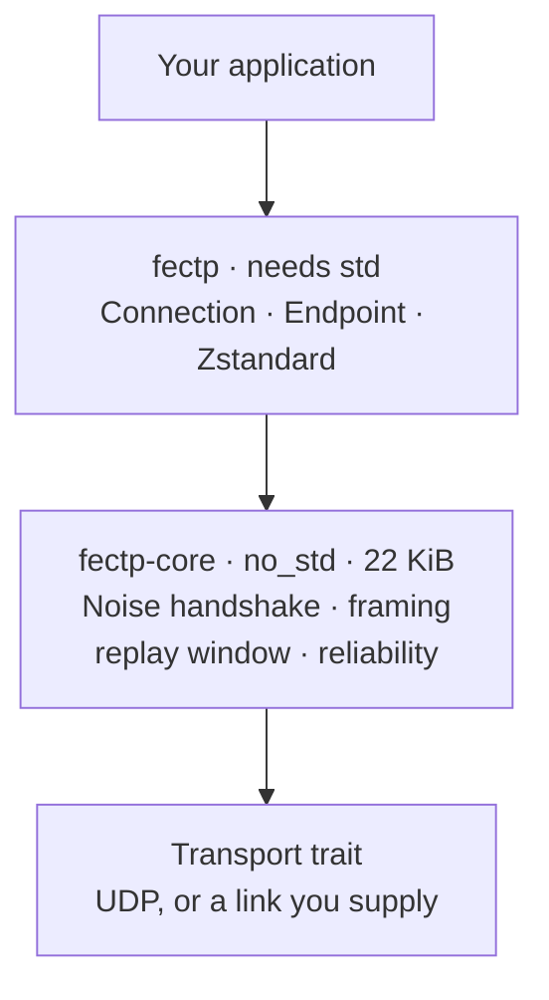

# FECTP — Fast Encrypted Compressed Transport Protocol

[](https://github.com/YounghyeonPark/fectp/actions/workflows/ci.yml)

**Three things, in one pass over your data: it goes out encrypted, compressed
for what it actually is, and with as little delay as possible.** Small enough
for a microcontroller, identical code on a server.

You hand it bytes, the peer gets those bytes. Tell it what the bytes *are* and
it compresses them properly — a general-purpose compressor manages 1.12x on
4-channel sensor data, and FECTP manages **3.46x** on the same bytes.

```rust
conn.send(b"a status line", PayloadType::Opaque)?;        // just bytes
conn.send(&samples, PayloadType::I16 { channels: 4 })?;   // 3.46x smaller
let n = conn.recv(&mut buf)?;
```

Encryption, compression, framing, and the decision of whether either is worth
the CPU all happen underneath.

---

## Contents

- [What it is for](#what-it-is-for) · [Why it's fast](#why-its-fast) · [Getting started](#getting-started)
- [**Compression**](#compression) · [**Security**](#security) · [Sending](#sending-data) · [Peers](#peers-not-clients-and-servers)
- [**Limitations**](#limitations) — what this does not do, and what is not safe to assume
- [Status](#status) · [Verification](#verification) · [Building](#building) · [Documentation](#documentation)

Everything here is the short version. **[docs/USAGE.md](docs/USAGE.md)** is the
task-by-task guide, and every snippet in both is compiled by the test suite.

---

## What it is for

Most encrypted transports make you choose. TLS over TCP is everywhere but costs
two round trips before the first byte moves, and its stack is far too large for
a microcontroller. Raw UDP is small and immediate but gives you nothing — no
encryption, no framing, no way to know a message arrived.

FECTP is for the middle: **an instrument, a sensor, or a service that needs to
send data encrypted, right now, and may be running on 32 KiB of RAM.**

| | |
|---|---|
| **Fast** | Data travels in the **very first packet** — no round trips spent agreeing on keys. |
| **Encrypted** | Noise, three modes, differing in what you must share beforehand rather than in how you use them. |
| **Compressed** | It knows what your data *is*, so it compresses structured binary where gzip and Zstandard cannot. |
| **Small** | The core is `no_std`, allocates nothing, and measures **22 KiB** of flash. |

Delivery is per-message: fire-and-forget by default, guaranteed when you ask.

**Not** for talking to a web browser, or anything expecting HTTP. This is a
transport for software you control on both ends. See
[Limitations](#limitations) for the rest.

### Two crates



A constrained device uses `fectp-core` alone and supplies its own socket, clock
and buffers. A server uses both. Same wire format either way, so a
microcontroller and a server talk to each other directly.

---

## Why it's fast

The usual cost of encryption is not the maths — encrypting a 1200-byte packet
takes about a microsecond. The cost is the **round trips spent agreeing on keys
before any real data may move**.

| Before your first byte can be sent | Round trips |
|---|---|
| **FECTP**, first ever contact | **0** |
| QUIC + TLS 1.3, first ever contact | 1 |
| QUIC + TLS 1.3, reconnecting to a known peer | 0 |
| TCP + TLS 1.3 | 2 |

FECTP manages this on *first* contact because of one trade: **the caller must
already know the peer's public key.** Nothing has to be negotiated, so the first
packet carries both the handshake and the payload. That key has to reach you
some other way — the same bargain as an SSH host key.

The handshake happens once per session, not per message. Afterwards each `send`
is one symmetric encryption and a 14-byte header. A session lasts until you drop
it; only losing it — a restart, a reboot, a new peer — costs another handshake,
and [resumption](docs/USAGE.md#resumption) cuts even that to a single X25519.

### Measured

Against raw UDP and TCP + TLS 1.3, on loopback:

| | median | vs raw UDP |
|---|---|---|
| raw UDP, no encryption | 31.6 µs | — |
| **FECTP, encrypted** | **35.8 µs** | **+13%** |
| TCP + TLS 1.3 | 64.4 µs | +104% |

The round-trip table matters more than this one — **on short connections**. At
150 ms of path latency FECTP gets a first answer 300 ms sooner than TCP + TLS,
but that is 300 ms *once, per connection*. Spread over ten thousand messages it
is 30 µs each; over a million it is nothing.

So: decisive for a sensor that wakes, reports and sleeps. Close to irrelevant
for a connection that opens once and streams.

[**BENCHMARKS.md**](docs/BENCHMARKS.md) has the full comparison — setup cost,
per-message overhead, compression against gzip and Zstandard, and behaviour
under packet loss, reordering, jitter, a bottleneck, a rebinding NAT and a
crowded endpoint. It changed the implementation five times, and it records the
measurements it got wrong before it got them right.

---

## Getting started

```toml
[dependencies]
fectp = { git = "https://github.com/younghyeonpark/fectp" }
```

One peer listens, one dials:

```rust
use std::time::Duration;
use fectp::{Connection, Endpoint, Event, Identity, PayloadType};

// ── Listening side ────────────────────────────────────────────────
let identity = Identity::generate();
let public_key = *identity.public();          // give this to the other side
let mut node = Endpoint::bind("0.0.0.0:4433", identity)?;

loop {
    match node.poll(Some(Duration::from_millis(100)))? {
        Event::Message { peer, data } =>
            node.send(peer, &data, PayloadType::Opaque)?,   // echo
        _ => {}
    }
}

// ── Dialling side ─────────────────────────────────────────────────
let mut conn = Connection::connect("host:4433", &public_key, &Identity::generate())?;
conn.send(b"hello", PayloadType::Opaque)?;

let mut buf = vec![0u8; 2048];
let n = conn.recv(&mut buf)?;
```

Full walkthrough, every snippet compiled and run:
**[docs/USAGE.md](docs/USAGE.md)**.

---

## Compression

A general-purpose compressor sees bytes and looks for repetition. Instrument
data has structure but little repetition — four interleaved ADC channels put
unrelated values side by side — so gzip and Zstandard find almost nothing in it.
**Tell FECTP what the bytes are and it compresses them properly.**

```rust
conn.send(&samples, PayloadType::I16 { channels: 4 })?;
conn.send(b"a status line", PayloadType::Opaque)?;      // just bytes
```

8 KiB payloads; ratio is raw ÷ coded, higher is better, FECTP's figures include
its own 4-byte header:

| dataset | gzip | Zstandard alone | **FECTP, shape declared** |
|---|---|---|---|
| sensor `i16` ×4, slowly varying | 1.19x | 1.12x | **3.46x** |
| counter `i32` ×2, monotonic | 2.77x | 1.67x | **292.57x** |
| `f32` calibration table | 1.56x | 1.14x | **8.21x** |
| JSON log lines | 78.77x | **126.03x** | 126.03x |
| random bytes | 1.00x | 1.00x | 1.00x |

**On structured binary, knowing the shape beats a better entropy coder.** On
text Zstandard already wins, so FECTP uses it and the transform gets out of the
way. On incompressible data nothing helps, and FECTP does not make it worse.

Every codec is lossless, and declaring the *wrong* shape is safe — the payload
still round-trips, it just compresses badly.

> The four shapes, what runs without a Zstandard decoder, and when compression
> is skipped: **[USAGE.md § Typed payloads](docs/USAGE.md#typed-payloads)**.
> Adding a shape: **[ADDING-A-CODEC.md](docs/ADDING-A-CODEC.md)**.

---

## Security

Three modes. They differ in **what has to be shared beforehand**, not in how you
use them — everything after the constructor is identical.

| Mode | You must share | Encrypted | Authenticated | Handshake |
|---|---|---|---|---|
| **Public key** | the peer's public key | yes | both sides, individually | 4 × X25519 |
| **Pre-shared key** | one secret | yes | as *a* holder of the secret | 1 × X25519 |
| **Plaintext** | nothing | **no** | **no** | none |

```rust
let conn = Connection::connect(addr, &server_public, &identity)?;   // public key
let conn = Connection::connect_psk(addr, b"lab-instrument-7")?;     // one secret
let conn = Connection::connect_plain(addr)?;                        // no crypto
```

`X25519` · `ChaCha20-Poly1305` · `BLAKE2s-256`, in the
[Noise](https://noiseprotocol.org/) framework, validated against an independent
implementation in both roles. Overhead is **30 bytes** per frame — a 14-byte
authenticated header and a 16-byte tag — or 14 in plaintext mode.

Three things that catch people out:

- **Modes never interoperate.** Their frame types are disjoint, so there is
  nothing on the wire to negotiate and **nothing to downgrade**.
- **A pre-shared key is symmetric.** Every holder can impersonate every other,
  so it belongs inside one system and not across organisations.
- **Data sent with the handshake is replayable** and has no forward secrecy.
  Idempotent payloads only — a sensor reading, never "open the valve".

> **Working with keys** — generating an identity, storing the secret, handing
> out the public half, and deciding which peers are allowed:
> **[USAGE.md § Identities and keys](docs/USAGE.md#identities-and-keys)**, and a
> runnable two-process version in
> [`examples/keys.rs`](crates/fectp/examples/keys.rs).
>
> Mode-by-mode detail, 0-RTT and session resumption:
> **[USAGE.md](docs/USAGE.md)**. Wire format: **[SPEC.md](docs/SPEC.md)**.

---

## Sending data

Two calls. The difference is what happens when a datagram goes missing.

```rust
conn.send(b"telemetry", PayloadType::Opaque)?;          // fire and forget
conn.send_reliable(b"command", PayloadType::Opaque)?;   // resent until acknowledged
conn.flush(Duration::from_secs(2))?;                    // wait for what is outstanding
```

`send` returns as soon as the datagram reaches the kernel — no acknowledgement,
no batching, one frame only.

**`send_reliable` takes any size.** A payload above the frame limit is split
across frames, each retransmitted on its own, and arrives as one message. There
is no separate call and **no size for you to compare against** — the limit is
whatever the peer advertised, so you could not know it in advance anyway.

`send` stays one frame because splitting something that cannot be retransmitted
fails whenever any piece goes missing: for 200 fragments at 1% loss, nine times
out of ten.

Reliable delivery is deliberately **not ordered** — see
[Limitations](#limitations). Driving retransmission, waiting for delivery, and
what to do when the window is full:
**[USAGE.md § Reliable delivery](docs/USAGE.md#reliable-delivery)**.

### What happens to a message


`send` is not a thin wrapper around `sendto`, but every step that would not pay
for itself is skipped — see
[USAGE.md](docs/USAGE.md#typed-payloads). What is left
is one symmetric encryption and a 14-byte header.

---

## Peers, not clients and servers

"Initiator" and "responder" describe a *connection*, not a node. An `Endpoint`
binds one socket and uses it **both** to accept connections and to start them;
after the handshake the session is symmetric and neither side is privileged.

```rust
let mut node = Endpoint::bind_psk("0.0.0.0:4433", b"mesh-secret")?;
let peer = node.connect("other-node:4433", None)?;   // the same socket
```

Sharing the socket is not tidiness. A NAT maps a **local port**, so a node that
dials out from one port and listens on another cannot be reached through the
mapping its own traffic just created. One socket is the precondition for hole
punching — though the punching itself is not built.

`connect` does not block: it sends the opening packet and returns a handle. The
handshake completes during `poll`, as `Event::Connected { initiated: true }`, or
gives up as `Event::ConnectFailed`.

One `Endpoint` serves one peer or a thousand, on one thread, with no locks and
no socket per peer:
`cargo run -p fectp --example mesh --features compress`.

---

## Limitations

Things this does not do, and things it would be wrong to assume. These are
unimplemented, not overlooked — [DECISIONS.md](docs/DECISIONS.md#known-gaps)
records what each one would cost to change.

### Security

| | |
|---|---|
| **Not audited** | See [Status](#status). This is the one that matters most. |
| **0-RTT data is replayable** | And has no forward secrecy. Idempotent payloads only — see [USAGE.md](docs/USAGE.md#sending-with-the-handshake). |
| **A pre-shared key is symmetric** | Every holder can impersonate every other. One administrative domain only. |
| **Plaintext mode is genuinely plaintext** | Read, forged and altered at will by anyone on the path. |
| **A resumption ticket is key material** | Store it as carefully as an identity secret. No expiry; 256 per responder, evicted oldest-first. |
| **A stranger can still cost you a handshake** | Anyone holding the public key can complete one — four X25519 operations. The peer table and the rate of new handshakes are both bounded, so a flood degrades connection setup rather than the process, but the work is not free. A replay from a new source address is a new handshake; only a cookie exchange would tell them apart, and that costs the round trip 0-RTT exists to save. |
| **No post-quantum option** | X25519 only. A PQC suite would be a new protocol version, not a negotiation. |
| **Public keys are your problem** | The protocol authenticates a key you already trust. Getting it to you is out of scope. |
| **The secret must be in process memory** | `Identity::from_secret` takes the raw 32 bytes and the handshake does its own Diffie-Hellman, so a secure element or HSM that never releases the key cannot be used without a change to `fectp-core`. |

### Delivery

| | |
|---|---|
| **No ordered delivery** | A message that arrives is delivered at once rather than held back for an earlier one — holding it back is head-of-line blocking, the exact cost this exists to avoid. Put a sequence number in your own payload if you need order. |
| **A session is bound to its peer's address** | A peer reappearing on a new source port is a stranger, and the session ends. Measured: a NAT rebind kills the session. |
| **No path MTU discovery** | Nothing probes the path. The 1200-byte default is safe anywhere and gives up a fifth of an ethernet frame; `set_max_datagram` reclaims it where the path is known, and silently loses datagrams where it is not. |
| **One loop serves every peer** | A message arriving behind a burst waits for it. With 23 busy peers the median is unchanged and p95 grows about fivefold. |

### Scope

| | |
|---|---|
| **Not for browsers** | Nothing here speaks HTTP or WebRTC. Both ends must be software you control. |
| **Not a P2P stack** | One socket serves both directions, which is the *precondition* for hole punching — but there is no peer discovery, address reflection or traversal coordination. |
| **UDP only** | A QUIC or TCP backend would slot into the `Transport` trait; neither is written. |

---

## Status

**Working:** handshake, data sent with the handshake, authenticated framing,
replay protection, reorder tolerance, capability negotiation, per-message
reliable delivery, messages split across frames, congestion control, session
resumption, many peers on one socket, outbound dialling on that same socket,
three security modes, optional length-masking padding, typed payload codecs,
optional Zstandard compression.

**Not built:** ordered delivery, path MTU discovery, address migration, ticket
expiry, peer discovery and NAT traversal, a QUIC backend, bit-packed deltas —
each with its consequence under [Limitations](#limitations).

**Not audited.** This is `#![forbid(unsafe_code)]`, cross-validated against an
independent Noise implementation, and has a conformance suite pinning every
normative constant — none of which is a substitute for review by someone who
breaks protocols for a living. Injecting packet loss found a bug that lost
messages outright while 179 tests passed, which is the honest measure of what
testing alone catches.

250 tests pass. Linked for `thumbv7em-none-eabihf`, the whole protocol costs
**22.0 KiB of flash** and needs 294 bytes of session state — 1,334 with reliable
delivery — plus the caller's buffers.

---

## Verification

Four things are checked mechanically, each because trusting it by eye had
already failed somewhere.

| What | How | Why |
|---|---|---|
| The handshake | [`interop.rs`](crates/fectp-core/tests/interop.rs) runs it against [`snow`](https://docs.rs/snow), an independent Noise implementation, **in both roles** | Any divergence in the key schedule, transcript hash, HMAC or HKDF makes the other side's decryption fail |
| The specification | [`spec_conformance.rs`](crates/fectp-core/tests/spec_conformance.rs) pins every constant [SPEC.md](docs/SPEC.md) states, and [`spec_independent.rs`](crates/fectp-core/tests/spec_independent.rs) is a second implementation written from the document alone | A spec that drifts is worse than none. Writing the second one found the two disagreeing about identifiers at the wrap — the code was wrong and the document was silent |
| The parsers | [`malformed_input.rs`](crates/fectp-core/tests/malformed_input.rs) puts arbitrary bytes through each decoder, and tampers with or truncates real frames | It found the varint decoder accepting overlong encodings, so a value had two spellings |
| The layers that keep state | [`reliability_model.rs`](crates/fectp-core/tests/reliability_model.rs), [`replay_model.rs`](crates/fectp-core/tests/replay_model.rs) and the reassembly model in [`pipeline.rs`](crates/fectp/src/pipeline.rs) drive each through generated orderings, with directed tests where a generator cannot reach the state | Every operation was individually correct; the bugs were in the sequences |
| The documentation | [`doc_snippets.rs`](crates/fectp/tests/doc_snippets.rs) extracts every Rust block from this file and [USAGE.md](docs/USAGE.md) and compiles it | A hand-written tour is a *copy*: it compiles happily while the original goes stale, which is how six calls kept passing an argument removed three commits earlier |

All of it runs on every push — [`ci.yml`](.github/workflows/ci.yml) — across
Linux, macOS and Windows, and in each feature configuration separately. That
last part is not fussiness: `cargo test --workspace` unifies features across the
graph, and the bench crate turning on `compress` was hiding a suite that failed
without it.

An independent implementation needs an off-the-shelf Noise library — both
patterns used exist for C, Go, Python, Java and JavaScript — plus the framing:
three fixed-size binary layouts and the transforms.

---

## Building

```bash
cargo test --workspace --features fectp/compress
```

Zstandard needs a C toolchain, so it is opt-in. Without it everything still
works; payloads simply go uncompressed, and the built-in integer transforms
still apply.

### Examples

```bash
cargo run -p fectp --example keys                        # identities: prints how to run it
cargo run -p fectp --example echo  --features compress   # the shortest pair
cargo run -p fectp --example mesh  --features compress   # many peers, one socket
cargo run -p fectp --example tour  --features compress   # every documented snippet
```

---

## Documentation

| | |
|---|---|
| [USAGE.md](docs/USAGE.md) | Task-by-task guide. Every snippet is compiled. |
| [API.md](docs/API.md) | The complete API, and where it is untidy. |
| [SPEC.md](docs/SPEC.md) | Normative wire format, for an independent implementation. |
| [DECISIONS.md](docs/DECISIONS.md) | Why it is built this way, including what was measured and got changed. |
| [BENCHMARKS.md](docs/BENCHMARKS.md) | Full comparison, with the methodology and the mistakes. |
| [ADDING-A-CODEC.md](docs/ADDING-A-CODEC.md) | Supporting a new data shape. |
| [FIXING-A-BUG.md](docs/FIXING-A-BUG.md) | How a fix is verified here, and the ways tests have passed without testing anything. |
| [footprint/README.md](crates/footprint/README.md) | What it costs on a microcontroller, measured on a linked image. |

---

## Licence

MIT OR Apache-2.0.
