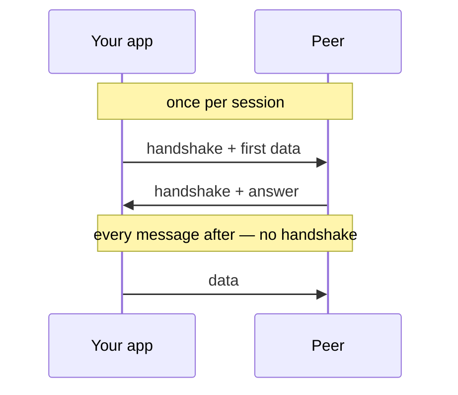
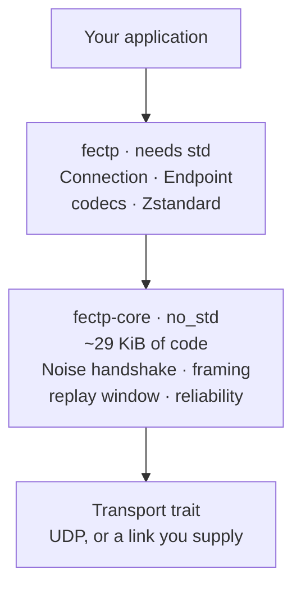
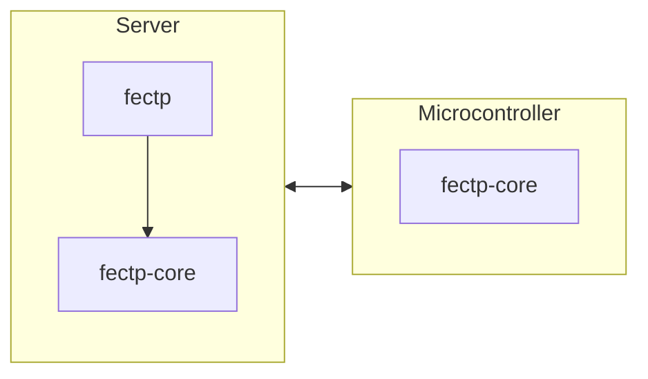
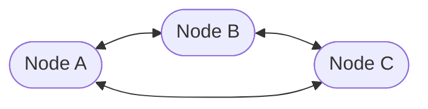

# FECTP

**An encrypted transport that gets your data moving with as little delay as
possible — small enough for a microcontroller, identical code on a server.**

You hand it bytes, the peer gets those bytes. Encryption, framing, and the
decision of whether compressing is even worth the CPU all happen underneath.

```rust
conn.send(b"hello", PayloadType::Opaque)?;
let n = conn.recv(&mut buf)?;
```

---

## What it is for

Most encrypted transports make you choose. TLS over TCP is everywhere but costs
two round trips before the first byte moves, and its stack is far too large for
a microcontroller. Raw UDP is small and immediate but gives you nothing —
no encryption, no framing, no way to know a message arrived.

FECTP is for the middle: **an instrument, a sensor, or a service that needs to
send data encrypted, right now, and may be running on 32 KiB of RAM.**

- Data travels in the **very first packet** — no waiting for a handshake.
- The core is `no_std` and allocates nothing. Roughly **29 KiB** of code.
- Delivery is per-message: fire-and-forget by default, guaranteed when you ask.
- It knows what your data *is*, so it can compress it properly.

### Not what it is for

Talking to a web browser, or anything that expects HTTP. This is a transport for
software you control on both ends. It is also **not** a general P2P stack —
there is no peer discovery and no NAT traversal, only the socket property those
would build on.

---

## Why it's fast

The usual cost of encryption is not the maths — encrypting a 1200-byte packet
takes about a microsecond. The cost is the **round trips spent agreeing on keys
before any real data may move**.



**The handshake happens once per session, not per message.** Afterwards each
`send` is one symmetric encryption — about a microsecond — and a 14-byte
header. No key agreement, ever again, until the session ends.

| Before your first byte can be sent | Round trips |
|---|---|
| **FECTP**, first ever contact | **0** |
| QUIC + TLS 1.3, first ever contact | 1 |
| QUIC + TLS 1.3, reconnecting to a known peer | 0 |
| TCP + TLS 1.3 | 2 |

FECTP manages this on *first* contact because of one trade: the caller must
already know the peer's public key. Nothing has to be negotiated, so the first
packet can carry both the handshake and the payload. That key has to reach you
some other way — the same bargain as an SSH host key.

A session lasts until you drop it. The only thing that costs another handshake
is losing the session — a restart, a reboot, a new peer — and
[resumption](#session-resumption) cuts even that to a single X25519 operation.

> Data sent with the handshake is encrypted but **replayable** by anyone who
> captures the packet. Send only what is safe to repeat.

### Measured

Against raw UDP and TCP + TLS 1.3, on loopback:

| | median | vs raw UDP |
|---|---|---|
| raw UDP, no encryption | 31.6 µs | — |
| **FECTP, encrypted** | **35.8 µs** | **+13%** |
| TCP + TLS 1.3 | 64.4 µs | +104% |

The round-trip table above matters more than this one, **on short
connections**. At 150 ms of path latency FECTP gets a first answer 300 ms
sooner than TCP + TLS — but that is 300 ms once, per connection. Spread over
ten thousand messages it is 30 µs each, which is the same order as the
difference this table measures; over a million it is nothing.

So: decisive for a sensor that wakes, reports and sleeps. Close to irrelevant
for a connection that opens once and streams.

[**BENCHMARKS.md**](docs/BENCHMARKS.md) has the full comparison — setup cost,
per-message overhead, compression against gzip and Zstandard, behaviour under
packet loss, reordering, jitter, a bottleneck, a rebinding NAT and a crowded
endpoint, and an honest account of the encryption trade-offs.

It has changed the implementation five times, most seriously when injecting
packet loss found a bug that lost messages outright, and it records the
measurements it got wrong before it got them right.

---

## Where it sits

Two crates. The lower one has no operating system in it at all, which is what
lets the same protocol run on a microcontroller and a server.



A constrained device uses `fectp-core` alone and supplies its own socket, clock
and buffers. A server uses both crates. They speak the same protocol:



Same wire format on both sides.

---

## Getting started

```toml
[dependencies]
fectp = { git = "https://github.com/younghyeonpark/fectp" }
```

The simplest pair — one peer listens, one dials:

```rust
use std::time::Duration;
use fectp::{Connection, Endpoint, Event, Identity, PayloadType};

// ── Listening side ────────────────────────────────────────────────
let identity = Identity::generate();
let public_key = *identity.public();          // give this to the other side
let mut node = Endpoint::bind("0.0.0.0:4433", identity)?;

loop {
    match node.poll(Some(Duration::from_millis(100)))? {
        Event::Message { peer, data } =>
            node.send(peer, &data, PayloadType::Opaque)?,   // echo
        _ => {}
    }
}

// ── Dialling side ─────────────────────────────────────────────────
let mut conn = Connection::connect("host:4433", &public_key, &Identity::generate())?;
conn.send(b"hello", PayloadType::Opaque)?;

let mut buf = vec![0u8; 2048];
let n = conn.recv(&mut buf)?;
```

Full walkthrough, with every snippet compiled and run by
[`examples/tour.rs`](crates/fectp/examples/tour.rs):
**[docs/USAGE.md](docs/USAGE.md)**.

---

## What happens to a message

`send` is not a thin wrapper around `sendto`. Each payload takes this path, and
every branch that costs anything is skipped when it would not pay:


Both middle steps are skipped when they would not pay, and the payload goes
straight through.

The "worth it?" test is real: a payload under 1 KiB, one that already looks
compressed, or one the peer cannot decompress goes straight through. If
compression runs and fails to shrink the payload, the original is sent. **A bad
guess costs CPU, never bytes.**

`send` returns as soon as the datagram reaches the kernel. It never waits for an
acknowledgement and never batches payloads the way a stream protocol does.

### On the wire

```
 byte  0        1          2 – 5              6 – 13          14 –
     ┌─────────┬─────────┬──────────────┬──────────────────┬───────────┐
     │ ver·type│  flags  │  session id  │ sequence number  │  payload  │
     └─────────┴─────────┴──────────────┴──────────────────┴───────────┘
     └──────────────── 14 bytes, always ─────────────────────┘
```

Fixed size, no length fields. Parsing a hostile packet involves no arithmetic
before it is authenticated — deliberate, because a microcontroller has no ASLR,
no NX bit and no MMU to contain a mistake there. The whole header is
authenticated along with the payload, so changing any byte of it makes
decryption fail.

The core carries `#![forbid(unsafe_code)]`, so none of this parsing can reach
for a raw pointer even by accident.

Overhead is **30 bytes** per frame (14 header + 16 authentication tag), or 14 in
plaintext mode, which has no tag because it has nothing to authenticate.

---

## Three security modes

Not every deployment faces the same threat, and the friction is never the
encryption — it is getting keys to where they need to be. So the modes differ in
**what has to be shared beforehand**, not in how you use them.

| Mode | You must share | Encrypted | Handshake cost | Suits |
|---|---|---|---|---|
| **Public key** | the peer's public key | yes | 4 × X25519 | the internet, several organisations |
| **Pre-shared key** | one secret | yes | 1 × X25519 | a lab network, one closed system |
| **Plaintext** | nothing | **no** | none | a cable you already trust, debugging |

<!-- doc-check: skip -->
```rust
Connection::connect(addr, &peer_public, &identity)?     // public key
Connection::connect_psk(addr, b"shared-secret")?        // one secret
Connection::connect_plain(addr)?                        // no crypto
```

**Everything after the constructor is identical** — same `send`, same `recv`,
same codecs, same reliability.

If public-key mode feels heavy, the answer is usually a pre-shared key rather
than turning encryption off: it removes key distribution entirely and keeps
both encryption and forward secrecy.

> **Modes never interoperate.** Their frame types do not overlap, so a peer in
> one mode simply does not understand a peer in another. There is nothing on the
> wire to negotiate, and therefore nothing to downgrade.

---

## Peers, not clients and servers

"Initiator" and "responder" describe a *connection*, not a node. An `Endpoint`
binds one socket and uses it **both** to accept connections and to start them;
once the handshake finishes the session is symmetric and neither side is
privileged.



Each node binds one port. Every link was dialled by one side and accepted by
the other, and after the handshake it makes no difference which.

```rust
let mut node = Endpoint::bind_psk("0.0.0.0:4433", b"mesh-secret")?;
let peer = node.connect("other-node:4433", None)?;   // the same socket
```

Sharing the socket is not tidiness. A NAT maps a **local port**, so a node that
dials out from one port and listens on another cannot be reached through the
mapping its own traffic just created. One socket is the precondition for hole
punching.

`connect` does not block: it sends the opening packet and returns a handle. The
handshake completes during `poll`, as `Event::Connected { initiated: true }`, or
gives up as `Event::ConnectFailed`.

One `Endpoint` serves one peer or a thousand, on one thread, with no locks and
no socket per peer. Try it:
`cargo run -p fectp --example mesh --features compress`.

---

## Messages larger than a frame

```rust
conn.send_reliable(&recording, PayloadType::Opaque)?;   // any size
conn.flush(Duration::from_secs(10))?;   // wait for it to arrive
```

A payload above the frame limit is split across frames, each retransmitted on
its own, and arrives as one message. There is no separate call and no size for
you to compare against — the limit depends on what the peer advertised, so you
could not know it in advance anyway.

`send` stays one frame only: splitting something that cannot be retransmitted
fails whenever any piece goes missing, which for 200 fragments at 1% loss is
nine times out of ten.

## Reliability, per message

```rust
conn.send(b"telemetry", PayloadType::Opaque)?;          // fire and forget
conn.send_reliable(b"command", PayloadType::Opaque)?;   // resent until acknowledged
conn.flush(Duration::from_secs(2))?;  // wait for what is outstanding
```

Reliable but deliberately **not ordered**. A message that arrives is delivered
at once rather than being held back for an earlier one — holding it back is
head-of-line blocking, the exact cost this protocol exists to avoid. If you need
order, put a sequence number in your own payload.

Acknowledgements are selective, so one gap does not stall everything behind it.
A retransmission goes out under a fresh sequence number, because that number is
the encryption nonce and can never repeat; a message identifier inside the
encrypted payload is what lets the receiver recognise the duplicate.

---

## Typed payloads

A general-purpose compressor sees only bytes. Tell it the shape and a transform
runs first:

```rust
let shape = PayloadType::I16 { channels: 4 };   // 4 channels of 16-bit ADC
conn.send(&samples, shape)?;
conn.send(b"a status line", PayloadType::Opaque)?;   // just bytes
```

On 8 KiB of 4-channel, slowly varying `i16` — ordinary instrument data:

| | Bytes on the wire |
|---|---|
| as `Opaque`, Zstandard alone | 7314 — **1.12x** |
| declared as `I16 { channels: 4 }` | 2367 — **3.46x** |

Interleaving is why: consecutive bytes come from different channels, so a
byte-oriented compressor finds nothing. Splitting by channel first exposes the
redundancy that was there all along. On monotonic `i32` counters the same trick
reaches 292x.

The shape is named at every send rather than set once on the connection. A
setting would mean a line's behaviour depended on a call somewhere else, and
forgetting it would cost compression **silently** — no error, no warning.
`PayloadType` is two bytes and `Copy`, so bind it to a local and pass it.

Every codec is **lossless** — a payload comes back byte for byte, and samples
one bit apart stay distinct. The transforms are plain integer code in the
`no_std` core, so a peer with no room for a Zstandard decoder still gets 2x on
that data. Declaring the wrong shape costs compression, never correctness.

Codecs are a registry, not a fixed set: supporting a new data type means writing
one transform — see [docs/ADDING-A-CODEC.md](docs/ADDING-A-CODEC.md).

---

## Session resumption

A full handshake is four X25519 operations per side. On a microcontroller that
is roughly a hundred milliseconds, paid again after **every reset**. Resumption
costs one:

```rust
let key = *conn.resumption_ticket().expect("encrypted").key();   // 32 bytes
save_to_flash(&key);

// after a reset
let conn = Connection::resume(addr, &Ticket::from_key(key), &peer_public)?;
```

Authentication comes from the ticket, which an earlier authenticated handshake
established, so identities stay bound. Fresh ephemeral keys are still exchanged,
so a resumed session keeps forward secrecy. Tickets are single use — each
handshake issues the next — which is what stops a captured resumption request
being replayed. Always keep the full-handshake path as a fallback.

---

## Status

**Working:** handshake, data sent with the handshake, authenticated framing,
replay protection, reorder tolerance, capability negotiation, per-message
reliable delivery, messages split across frames, congestion control, session
resumption, many peers on one socket, outbound dialling on that same socket,
three security modes, optional length-masking padding, typed payload codecs,
optional Zstandard compression.

**Not built:** ordered delivery, path MTU discovery, address migration, ticket
expiry, peer discovery and NAT traversal, a QUIC backend, bit-packed deltas.
[DECISIONS.md](docs/DECISIONS.md) lists each with what it would cost.

**Not audited.** This is `#![forbid(unsafe_code)]`, cross-validated against an
independent Noise implementation, and has a conformance suite pinning every
normative constant — none of which is a substitute for review by someone who
breaks protocols for a living. Injecting packet loss found a bug that lost
messages outright while 179 tests passed, which is the honest measure of what
testing alone catches.

Every parser is now also driven with generated input
([`tests/malformed_input.rs`](crates/fectp-core/tests/malformed_input.rs)):
arbitrary bytes at each decoder, and real frames tampered with or truncated a
byte at a time. It found the varint decoder accepting overlong encodings, so a
value had two spellings. That one was reachable only from an authenticated
peer, and it is the kind of thing hand-written tests do not think to try.

208 tests pass. Linked for `thumbv7em-none-eabihf`, the whole protocol costs
**22.0 KiB of flash** and needs 294 bytes of session state — 1,334 with
reliable delivery — plus the caller's buffers.

---

## Verification

The handshake is validated against [`snow`](https://docs.rs/snow), an
independent Noise implementation, **in both roles** — see
[`tests/interop.rs`](crates/fectp-core/tests/interop.rs). Any divergence in the
key schedule, transcript hash, HMAC or HKDF would make the other side's
decryption fail, so a passing run exercises the entire handshake.

[docs/SPEC.md](docs/SPEC.md) is a normative wire specification. Every constant
in it is pinned by
[`tests/spec_conformance.rs`](crates/fectp-core/tests/spec_conformance.rs), so
the specification cannot quietly drift away from the code.

The documentation is held to the same standard, because it drifted anyway.
[`tests/doc_snippets.rs`](crates/fectp/tests/doc_snippets.rs) extracts every
Rust block from this file and [docs/USAGE.md](docs/USAGE.md) and compiles it
against the real API. Transcribing the examples into a runnable tour was not
enough — a copy compiles happily while the original goes stale, which is how
six calls kept passing a timeout argument that had been removed three commits
earlier. The documents are now the input, so that failure is a build failure.

An independent implementation needs an off-the-shelf Noise library — the two
patterns used, `Noise_IK_25519_ChaChaPoly_BLAKE2s` and
`Noise_NNpsk0_25519_ChaChaPoly_BLAKE2s`, exist for C, Go, Python, Java and
JavaScript — plus the framing: three fixed-size binary layouts and the
transforms.

---

## Building

```bash
cargo test --workspace --features fectp/compress
```

Zstandard needs a C toolchain, so it is opt-in. Without it everything still
works; payloads simply go uncompressed, and the built-in integer transforms
still apply.

```bash
cargo build -p fectp-core --target thumbv7em-none-eabihf --release   # embedded check
```

### Examples

```bash
cargo run -p fectp --example tour          --features compress   # every documented snippet
cargo run -p fectp --example echo          --features compress   # one peer, round-trip timings
cargo run -p fectp --example multi_client  --features compress   # six clients, one socket
cargo run -p fectp --example mesh          --features compress   # three peers, all dialling
```

---

## Documentation

| | |
|---|---|
| [USAGE.md](docs/USAGE.md) | How to use it. Every snippet is compiled by `examples/tour.rs`. |
| [API.md](docs/API.md) | Every public method, grouped by what you are trying to do. |
| [SPEC.md](docs/SPEC.md) | Normative wire format — everything an independent implementation needs. |
| [DECISIONS.md](docs/DECISIONS.md) | Why the protocol is shaped this way, and where it departs from the original design note. |
| [ADDING-A-CODEC.md](docs/ADDING-A-CODEC.md) | Supporting a new data type. |
| [BENCHMARKS.md](docs/BENCHMARKS.md) | Measured against UDP, TLS, gzip and Zstandard, and under loss — including where it loses. |
| [crates/footprint](crates/footprint/README.md) | What it costs on a microcontroller, linked rather than estimated. |

---

## Licence

BSD 3-Clause. See [LICENSE](LICENSE).
