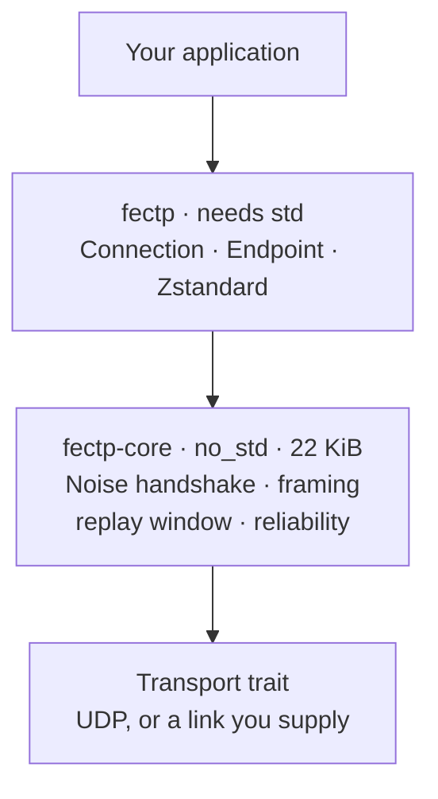
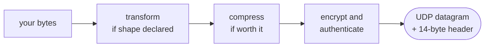

# FECTP

**An encrypted transport that gets your data moving with as little delay as
possible — small enough for a microcontroller, identical code on a server.**

You hand it bytes, the peer gets those bytes. Encryption, framing, and the
decision of whether compressing is even worth the CPU all happen underneath.

```rust
conn.send(b"hello", PayloadType::Opaque)?;
let n = conn.recv(&mut buf)?;
```

---

## Contents

- [What it is for](#what-it-is-for) · [Why it's fast](#why-its-fast) · [Getting started](#getting-started)
- [Security](#security) — [the three modes](#choosing-a-mode), [0-RTT](#data-in-the-first-packet), [resumption](#session-resumption)
- [Sending](#sending-data) · [Typed payloads](#typed-payloads) · [Peers](#peers-not-clients-and-servers)
- [**Limitations**](#limitations) — what this does not do, and what is not safe to assume
- [Status](#status) · [Verification](#verification) · [Building](#building)

---

## What it is for

Most encrypted transports make you choose. TLS over TCP is everywhere but costs
two round trips before the first byte moves, and its stack is far too large for
a microcontroller. Raw UDP is small and immediate but gives you nothing — no
encryption, no framing, no way to know a message arrived.

FECTP is for the middle: **an instrument, a sensor, or a service that needs to
send data encrypted, right now, and may be running on 32 KiB of RAM.**

- Data travels in the **very first packet** — no waiting for a handshake.
- The core is `no_std`, allocates nothing, and measures **22 KiB** of flash.
- Delivery is per-message: fire-and-forget by default, guaranteed when you ask.
- It knows what your data *is*, so it can compress it properly.

**Not** for talking to a web browser, or anything expecting HTTP. This is a
transport for software you control on both ends. See
[Limitations](#limitations) for the rest.

### Two crates



A constrained device uses `fectp-core` alone and supplies its own socket, clock
and buffers. A server uses both. Same wire format either way, so a
microcontroller and a server talk to each other directly.

---

## Why it's fast

The usual cost of encryption is not the maths — encrypting a 1200-byte packet
takes about a microsecond. The cost is the **round trips spent agreeing on keys
before any real data may move**.

| Before your first byte can be sent | Round trips |
|---|---|
| **FECTP**, first ever contact | **0** |
| QUIC + TLS 1.3, first ever contact | 1 |
| QUIC + TLS 1.3, reconnecting to a known peer | 0 |
| TCP + TLS 1.3 | 2 |

FECTP manages this on *first* contact because of one trade: **the caller must
already know the peer's public key.** Nothing has to be negotiated, so the first
packet carries both the handshake and the payload. That key has to reach you
some other way — the same bargain as an SSH host key.

The handshake happens once per session, not per message. Afterwards each `send`
is one symmetric encryption and a 14-byte header. A session lasts until you drop
it; only losing it — a restart, a reboot, a new peer — costs another handshake,
and [resumption](#session-resumption) cuts even that to a single X25519.

### Measured

Against raw UDP and TCP + TLS 1.3, on loopback:

| | median | vs raw UDP |
|---|---|---|
| raw UDP, no encryption | 31.6 µs | — |
| **FECTP, encrypted** | **35.8 µs** | **+13%** |
| TCP + TLS 1.3 | 64.4 µs | +104% |

The round-trip table matters more than this one — **on short connections**. At
150 ms of path latency FECTP gets a first answer 300 ms sooner than TCP + TLS,
but that is 300 ms *once, per connection*. Spread over ten thousand messages it
is 30 µs each; over a million it is nothing.

So: decisive for a sensor that wakes, reports and sleeps. Close to irrelevant
for a connection that opens once and streams.

[**BENCHMARKS.md**](docs/BENCHMARKS.md) has the full comparison — setup cost,
per-message overhead, compression against gzip and Zstandard, and behaviour
under packet loss, reordering, jitter, a bottleneck, a rebinding NAT and a
crowded endpoint. It changed the implementation five times, and it records the
measurements it got wrong before it got them right.

---

## Getting started

```toml
[dependencies]
fectp = { git = "https://github.com/younghyeonpark/fectp" }
```

One peer listens, one dials:

```rust
use std::time::Duration;
use fectp::{Connection, Endpoint, Event, Identity, PayloadType};

// ── Listening side ────────────────────────────────────────────────
let identity = Identity::generate();
let public_key = *identity.public();          // give this to the other side
let mut node = Endpoint::bind("0.0.0.0:4433", identity)?;

loop {
    match node.poll(Some(Duration::from_millis(100)))? {
        Event::Message { peer, data } =>
            node.send(peer, &data, PayloadType::Opaque)?,   // echo
        _ => {}
    }
}

// ── Dialling side ─────────────────────────────────────────────────
let mut conn = Connection::connect("host:4433", &public_key, &Identity::generate())?;
conn.send(b"hello", PayloadType::Opaque)?;

let mut buf = vec![0u8; 2048];
let n = conn.recv(&mut buf)?;
```

Full walkthrough, every snippet compiled and run:
**[docs/USAGE.md](docs/USAGE.md)**.

---

## Security

### Choosing a mode

The friction is never the encryption — it is getting keys to where they need to
be. So the modes differ in **what has to be shared beforehand**, not in how you
use them.

| Mode | You must share | Encrypted | Authenticated | Handshake | Suits |
|---|---|---|---|---|---|
| **Public key** | the peer's public key | yes | both sides, individually | 4 × X25519 | the internet, several organisations |
| **Pre-shared key** | one secret | yes | only as "a holder of the secret" | 1 × X25519 | a lab network, one closed system |
| **Plaintext** | nothing | **no** | **no** | none | a cable you already trust, debugging |

**Everything after the constructor is identical** — same `send`, same `recv`,
same codecs, same reliability. Only the way you open the connection changes.

> **Modes never interoperate.** Their frame types do not overlap, so a peer in
> one mode simply does not understand a peer in another. There is nothing on the
> wire to negotiate, and therefore **nothing to downgrade**.

---

### Public key — `Noise_IK_25519_ChaChaPoly_BLAKE2s`

Each peer has its own long-term identity. Use this whenever the peers belong to
different people or different organisations.

```rust
// Listening side: hand out `identity.public()` however you like.
let identity = Identity::generate();
let public_key = *identity.public();
let mut server = Endpoint::bind("0.0.0.0:4433", identity)?;

// Dialling side: needs the listener's public key in advance.
let conn = Connection::connect(addr, &server_public, &Identity::generate())?;
```

An `Identity` is an X25519 keypair. Persist the secret to keep the same
identity across restarts, exactly as an SSH host key is persisted:

```rust
let secret = *identity.secret();       // 32 bytes — treat as a private key
save_to_flash(&secret);
let identity = Identity::from_secret(load_from_flash());
```

**What you get.** Both sides are authenticated, each as a distinct identity —
and the responder authenticates the initiator from **message 1 alone**, so an
unknown peer is rejected before it can send a second packet. Once the handshake
completes the session has forward secrecy: recovering a static secret later does
not decrypt traffic already captured.

**What it does not do.** It does not distribute the public key. You must already
have it, by whatever means you trust — configuration, provisioning, a QR code on
the device. A peer who accepts *any* key on first sight has authenticated
nothing.

---

### Pre-shared key — `Noise_NNpsk0_25519_ChaChaPoly_BLAKE2s`

One secret both sides already hold. No per-peer keys to distribute.

```rust
let mut server = Endpoint::bind_psk("0.0.0.0:4433", b"lab-instrument-7")?;
let conn = Connection::connect_psk(addr, b"lab-instrument-7")?;
```

The secret may be any length; it is hashed into the key material
(`BLAKE2s-256("fectp/1 psk" || secret)`), so a human-chosen string is accepted
but is only as strong as its entropy.

**What you get.** Full encryption and **forward secrecy** — both peers still
contribute fresh ephemeral keys, so a leaked secret does not decrypt past
traffic. One X25519 per side instead of four, which is why this is the mode a
microcontroller usually wants. Unlike a resumption ticket, a configured
pre-shared key is *not* consumed on use; it is long-lived by definition.

**What it does not do.** The secret is symmetric: **every holder can impersonate
every other holder.** There is no way to tell two peers apart, revoke one, or
prove which of them sent something. That is fine inside one administrative
domain and wrong across several — there, use public-key mode.

---

### Plaintext — no cryptography at all

```rust
let mut server = Endpoint::bind_plain("0.0.0.0:4433")?;
let conn = Connection::connect_plain(addr)?;
```

Framing, reliability, fragmentation and codecs all still work. The 14-byte
header is there; the 16-byte authentication tag is not, because there is nothing
to authenticate.

**Anyone on the path can read, forge, or alter every byte.** No encryption, no
authentication, no identities. It exists for links that are physically trusted
and for development, where a readable packet capture is worth more than
confidentiality.

**It is not the remedy for awkward key distribution.** Encrypting a frame costs
about a microsecond; distribution is what costs anything, and pre-shared-key
mode removes that without giving up encryption.

---

### Data in the first packet

Both encrypted modes can carry a payload in the opening handshake message, so
the peer has your data after **zero** round trips:

```rust
let conn = Connection::connect_and_send(addr, &server_public, &identity, &reading)?;
```

> **This data is replayable.** There is no replay protection on the first
> message, so an attacker who captures the packet can send it again later, and
> the responder cannot tell. It also has **no forward secrecy** — it is
> protected only by the responder's static key.
>
> Put only idempotent, non-sensitive data here: a sensor reading, a status
> line. Never a command, a transfer, or anything that must not happen twice.

Everything after the handshake has both replay protection and forward secrecy.
0-RTT saves exactly one round trip, once, per connection — worth it for a device
that wakes, reports and sleeps, and worth nothing for a long-lived stream.

---

### Session resumption

A full handshake is four X25519 operations per side — roughly a hundred
milliseconds on a microcontroller, paid again after **every reset**. Resumption
costs one:

```rust
let key = *conn.resumption_ticket().expect("encrypted").key();   // 32 bytes
save_to_flash(&key);

// after a reset
let conn = Connection::resume(addr, &Ticket::from_key(key), &peer_public)?;
```

**What you get.** Authentication carries over from the earlier authenticated
handshake that issued the ticket, so identities stay bound. Fresh ephemerals are
still exchanged, so a resumed session keeps forward secrecy. Tickets are single
use — each handshake issues the next — which is what stops a captured resumption
request being replayed.

**What it does not do.** The ticket **is key material**: store it as carefully as
the identity secret. Tickets have no expiry, only a bound of 256 per responder,
evicted oldest-first. And a server that restarted or evicted yours cannot
answer, so always keep the full handshake as a fallback.

---

### What is under all of it

`X25519` · `ChaCha20-Poly1305` · `BLAKE2s-256` · `HKDF`, in the
[Noise](https://noiseprotocol.org/) framework. The handshake is validated
against an independent implementation in both roles.

```
 byte  0        1          2 – 5              6 – 13          14 –
     ┌─────────┬─────────┬──────────────┬──────────────────┬───────────┐
     │ ver·type│  flags  │  session id  │ sequence number  │  payload  │
     └─────────┴─────────┴──────────────┴──────────────────┴───────────┘
     └──────────────── 14 bytes, always ─────────────────────┘
```

Fixed size, no length fields: parsing a hostile packet involves no arithmetic
before it is authenticated. That is deliberate — a microcontroller has no ASLR,
no NX bit and no MMU to contain a mistake there, and the core carries
`#![forbid(unsafe_code)]` so none of this parsing can reach for a raw pointer
even by accident. The whole header is authenticated along with the payload, so
changing any byte of it makes decryption fail.

Overhead is **30 bytes** per frame (14 header + 16 tag), or 14 in plaintext mode.

---

## Sending data

Two calls. The difference is what happens when a datagram goes missing.

```rust
conn.send(b"telemetry", PayloadType::Opaque)?;          // fire and forget
conn.send_reliable(b"command", PayloadType::Opaque)?;   // resent until acknowledged
conn.flush(Duration::from_secs(2))?;                    // wait for what is outstanding
```

`send` returns as soon as the datagram reaches the kernel. It never waits for an
acknowledgement and never batches the way a stream protocol does.

**`send_reliable` takes any size.** A payload above the frame limit is split
across frames, each retransmitted on its own, and arrives as one message. There
is no separate call and no size for you to compare against — the limit depends
on what the peer advertised, so you could not know it in advance anyway.

```rust
conn.send_reliable(&recording, PayloadType::Opaque)?;   // any size
conn.flush(Duration::from_secs(10))?;                   // wait for it to arrive
```

`send` stays one frame only: splitting something that cannot be retransmitted
fails whenever any piece goes missing, which for 200 fragments at 1% loss is
nine times out of ten.

Reliable delivery is deliberately **not ordered** — see
[Limitations](#limitations).

### What happens to a message



The "worth it?" test is real, and the two steps have different thresholds. A
transform runs from **32 bytes** up, because delta-coding a hundred samples
already halves them. Zstandard waits for **1 KiB**, and is skipped anyway for a
payload that already looks compressed or that the peer cannot decompress. If
compression runs and fails to shrink the payload, the original is sent. **A bad
guess costs CPU, never bytes.**

---

## Typed payloads

A general-purpose compressor sees only bytes. Tell it the shape and a transform
runs first:

```rust
let shape = PayloadType::I16 { channels: 4 };   // 4 channels of 16-bit ADC
conn.send(&samples, shape)?;
conn.send(b"a status line", PayloadType::Opaque)?;   // just bytes
```

On 8 KiB of 4-channel, slowly varying `i16` — ordinary instrument data:

| | Bytes on the wire |
|---|---|
| as `Opaque`, Zstandard alone | 7314 — **1.12x** |
| declared as `I16 { channels: 4 }` | 2367 — **3.46x** |

Interleaving is why: consecutive bytes come from different channels, so a
byte-oriented compressor finds nothing. Splitting by channel first exposes the
redundancy that was there all along. On monotonic `i32` counters the same trick
reaches 292x.

Every codec is **lossless** — a payload comes back byte for byte. The transforms
are plain integer code in the `no_std` core, so a peer with no room for a
Zstandard decoder still gets 2x on that data. Declaring the wrong shape costs
compression, never correctness.

Codecs are a registry, not a fixed set:
[docs/ADDING-A-CODEC.md](docs/ADDING-A-CODEC.md).

---

## Peers, not clients and servers

"Initiator" and "responder" describe a *connection*, not a node. An `Endpoint`
binds one socket and uses it **both** to accept connections and to start them;
after the handshake the session is symmetric and neither side is privileged.

```rust
let mut node = Endpoint::bind_psk("0.0.0.0:4433", b"mesh-secret")?;
let peer = node.connect("other-node:4433", None)?;   // the same socket
```

Sharing the socket is not tidiness. A NAT maps a **local port**, so a node that
dials out from one port and listens on another cannot be reached through the
mapping its own traffic just created. One socket is the precondition for hole
punching — though the punching itself is not built.

`connect` does not block: it sends the opening packet and returns a handle. The
handshake completes during `poll`, as `Event::Connected { initiated: true }`, or
gives up as `Event::ConnectFailed`.

One `Endpoint` serves one peer or a thousand, on one thread, with no locks and
no socket per peer:
`cargo run -p fectp --example mesh --features compress`.

---

## Limitations

Things this does not do, and things it would be wrong to assume. These are
unimplemented, not overlooked — [DECISIONS.md](docs/DECISIONS.md#known-gaps)
records what each one would cost to change.

### Security

| | |
|---|---|
| **Not audited** | See [Status](#status). This is the one that matters most. |
| **0-RTT data is replayable** | And has no forward secrecy. Idempotent payloads only — see [above](#data-in-the-first-packet). |
| **A pre-shared key is symmetric** | Every holder can impersonate every other. One administrative domain only. |
| **Plaintext mode is genuinely plaintext** | Read, forged and altered at will by anyone on the path. |
| **A resumption ticket is key material** | Store it as carefully as an identity secret. No expiry; 256 per responder, evicted oldest-first. |
| **No post-quantum option** | X25519 only. A PQC suite would be a new protocol version, not a negotiation. |
| **Public keys are your problem** | The protocol authenticates a key you already trust. Getting it to you is out of scope. |

### Delivery

| | |
|---|---|
| **No ordered delivery** | A message that arrives is delivered at once rather than held back for an earlier one — holding it back is head-of-line blocking, the exact cost this exists to avoid. Put a sequence number in your own payload if you need order. |
| **A session is bound to its peer's address** | A peer reappearing on a new source port is a stranger, and the session ends. Measured: a NAT rebind kills the session. |
| **No path MTU discovery** | Frames are 1200 bytes, or whatever the peer advertised. Safe on the internet, and smaller than a LAN could carry. |
| **One loop serves every peer** | A message arriving behind a burst waits for it. With 23 busy peers the median is unchanged and p95 grows about fivefold. |

### Scope

| | |
|---|---|
| **Not for browsers** | Nothing here speaks HTTP or WebRTC. Both ends must be software you control. |
| **Not a P2P stack** | One socket serves both directions, which is the *precondition* for hole punching — but there is no peer discovery, address reflection or traversal coordination. |
| **UDP only** | A QUIC or TCP backend would slot into the `Transport` trait; neither is written. |

---

## Status

**Working:** handshake, data sent with the handshake, authenticated framing,
replay protection, reorder tolerance, capability negotiation, per-message
reliable delivery, messages split across frames, congestion control, session
resumption, many peers on one socket, outbound dialling on that same socket,
three security modes, optional length-masking padding, typed payload codecs,
optional Zstandard compression.

**Not built:** ordered delivery, path MTU discovery, address migration, ticket
expiry, peer discovery and NAT traversal, a QUIC backend, bit-packed deltas —
each with its consequence under [Limitations](#limitations).

**Not audited.** This is `#![forbid(unsafe_code)]`, cross-validated against an
independent Noise implementation, and has a conformance suite pinning every
normative constant — none of which is a substitute for review by someone who
breaks protocols for a living. Injecting packet loss found a bug that lost
messages outright while 179 tests passed, which is the honest measure of what
testing alone catches.

208 tests pass. Linked for `thumbv7em-none-eabihf`, the whole protocol costs
**22.0 KiB of flash** and needs 294 bytes of session state — 1,334 with reliable
delivery — plus the caller's buffers.

---

## Verification

Four things are checked mechanically, each because trusting it by eye had
already failed somewhere.

| What | How | Why |
|---|---|---|
| The handshake | [`interop.rs`](crates/fectp-core/tests/interop.rs) runs it against [`snow`](https://docs.rs/snow), an independent Noise implementation, **in both roles** | Any divergence in the key schedule, transcript hash, HMAC or HKDF makes the other side's decryption fail |
| The specification | [`spec_conformance.rs`](crates/fectp-core/tests/spec_conformance.rs) pins every constant [SPEC.md](docs/SPEC.md) states | A spec that drifts is worse than none — an independent implementation would fail and nothing would catch it |
| The parsers | [`malformed_input.rs`](crates/fectp-core/tests/malformed_input.rs) puts arbitrary bytes through each decoder, and tampers with or truncates real frames | It found the varint decoder accepting overlong encodings, so a value had two spellings |
| The documentation | [`doc_snippets.rs`](crates/fectp/tests/doc_snippets.rs) extracts every Rust block from this file and [USAGE.md](docs/USAGE.md) and compiles it | A hand-written tour is a *copy*: it compiles happily while the original goes stale, which is how six calls kept passing an argument removed three commits earlier |

An independent implementation needs an off-the-shelf Noise library — both
patterns used exist for C, Go, Python, Java and JavaScript — plus the framing:
three fixed-size binary layouts and the transforms.

---

## Building

```bash
cargo test --workspace --features fectp/compress
```

Zstandard needs a C toolchain, so it is opt-in. Without it everything still
works; payloads simply go uncompressed, and the built-in integer transforms
still apply.

### Examples

```bash
cargo run -p fectp --example tour  --features compress   # every documented snippet
cargo run -p fectp --example mesh  --features compress   # many peers, one socket
cargo run -p fectp --example echo  --features compress   # the shortest pair
```

---

## Documentation

| | |
|---|---|
| [USAGE.md](docs/USAGE.md) | Task-by-task guide. Every snippet is compiled. |
| [API.md](docs/API.md) | The complete API, and where it is untidy. |
| [SPEC.md](docs/SPEC.md) | Normative wire format, for an independent implementation. |
| [DECISIONS.md](docs/DECISIONS.md) | Why it is built this way, including what was measured and got changed. |
| [BENCHMARKS.md](docs/BENCHMARKS.md) | Full comparison, with the methodology and the mistakes. |
| [ADDING-A-CODEC.md](docs/ADDING-A-CODEC.md) | Supporting a new data shape. |
| [footprint/README.md](crates/footprint/README.md) | What it costs on a microcontroller, measured on a linked image. |

---

## Licence

MIT OR Apache-2.0.
